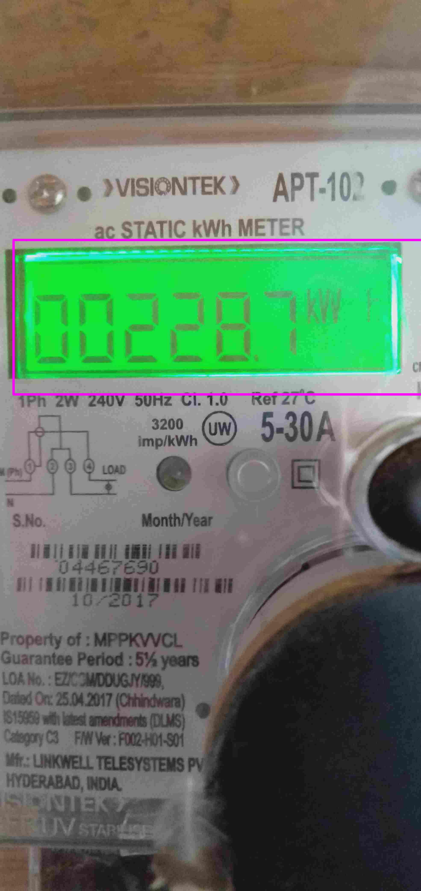
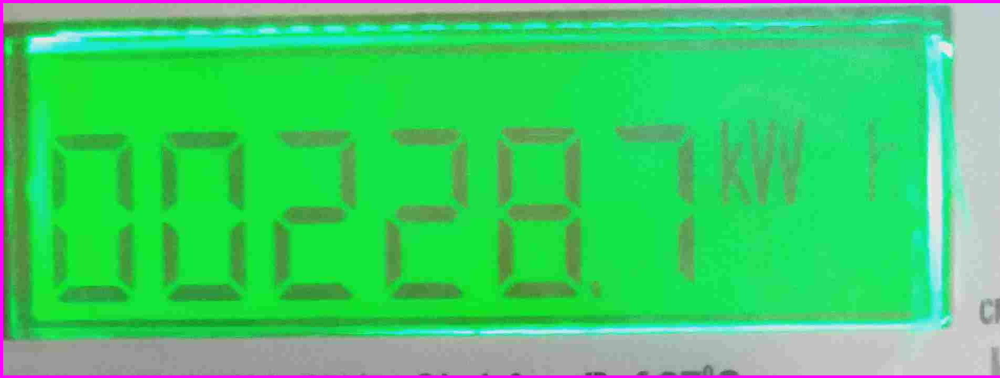
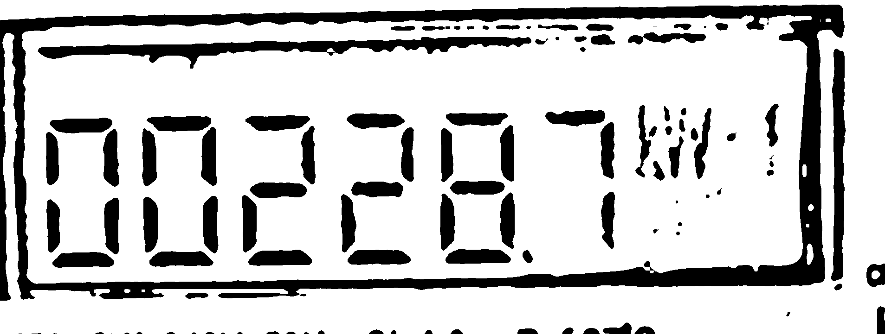

# Meter display segmentation and reading the digits using OCR

### Packages required:
1. OS `import os`
2. OpenCV v3.4.3 `import cv2`
3. Numpy v1.16 `import numpy as np`
4. PIL `from PIL import Image`

Following step has been used to extract the meter display:

1. Read the image
2. Convert the image from RGB to HSV colorspace
3. Create a mask of the image where the color which falls in a particular range
4. Find the largest contour in the mask image as the display will be the largest contour
5. Create bounding box over the largest contour
6. Extract the bounding box portion from the original image
7. Use adaptive thresholding on the extracted meter display to get a binary image with less amount of noise

Further Processing required:

1. Skew Correction of the extracted image
2. Read the digits using OCR to get the meter reading
